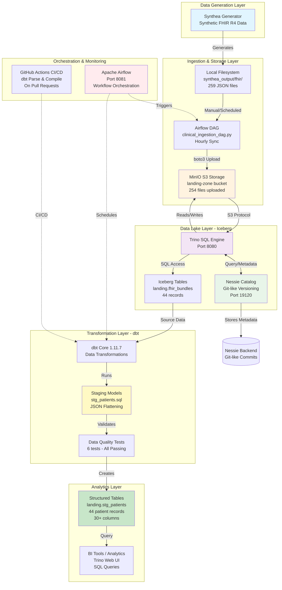

# Healthcare Data Mesh - Dataflow Diagram

## Overview Architecture



## Detailed Component Flow

### 1. Data Generation Flow

```
┌─────────────────────────────────────────────────────────────┐
│                    SYNTHEA GENERATOR                         │
│  - Generates synthetic healthcare data                      │
│  - Format: HL7 FHIR R4 JSON Bundles                        │
│  - Output: 20 patients per run (configurable)              │
│  - Location: ./synthea_output/fhir/*.json                  │
└────────────────────────┬────────────────────────────────────┘
                         │
                         ↓ (JSON Files Generated)
┌─────────────────────────────────────────────────────────────┐
│                  LOCAL FILESYSTEM                            │
│  Files: 259 FHIR JSON files                                 │
│  Size: ~2.7 GB total                                        │
│  Content: Patient demographics, encounters, observations    │
└─────────────────────────────────────────────────────────────┘
```

### 2. Ingestion Flow

```
┌────────────────────────────────────────────────────────────────┐
│                    INGESTION PIPELINE                          │
│                                                                │
│  Option A: Airflow DAG (Automated)                           │
│  ┌──────────────────────────────────────┐                    │
│  │  clinical_ingestion_dag.py           │                    │
│  │  - Runs: @hourly                     │                    │
│  │  - Scans: synthea_output/fhir/       │                    │
│  │  - Uploads: boto3 → MinIO            │                    │
│  └──────────────────────────────────────┘                    │
│                     ↓                                          │
│  Option B: Manual Upload Script                              │
│  ┌──────────────────────────────────────┐                    │
│  │  scripts/upload_fhir_to_minio.py     │                    │
│  │  - Uploads all files to S3           │                    │
│  │  - Adds metadata tags                │                    │
│  └──────────────────────────────────────┘                    │
│                     ↓                                          │
│  Option C: Direct Load to Trino                              │
│  ┌──────────────────────────────────────┐                    │
│  │  scripts/load_fhir_to_trino.py       │                    │
│  │  - Inserts via SQL (small files)     │                    │
│  │  - Max size: ~1MB per file           │                    │
│  └──────────────────────────────────────┘                    │
└────────────────────────────────────────────────────────────────┘
                         ↓
┌─────────────────────────────────────────────────────────────┐
│                    MINIO OBJECT STORAGE                      │
│  Bucket: landing-zone                                       │
│  Prefix: raw/fhir/                                          │
│  Files: 254 uploaded                                        │
│  Protocol: S3-compatible                                    │
│  Endpoint: http://minio:9000                                │
└─────────────────────────────────────────────────────────────┘
```

### 3. Data Lake Layer Flow

```
┌────────────────────────────────────────────────────────────────┐
│                      TRINO QUERY ENGINE                        │
│  - Port: 8080                                                 │
│  - Web UI: http://localhost:8080/ui/                          │
│  - Catalogs: iceberg, system                                  │
│  - Connection: dbt-trino adapter                              │
└────────┬───────────────────────────────────────┬───────────────┘
         │                                       │
         ↓                                       ↓
┌─────────────────────┐              ┌──────────────────────────┐
│  NESSIE CATALOG     │              │   ICEBERG TABLES         │
│  - Port: 19120      │◄─────────────┤   Schema: landing        │
│  - API: REST        │   Metadata   │   Tables:                │
│  - Branch: main     │              │   - fhir_bundles         │
│  - Commits tracked  │              │   - stg_patients         │
└─────────────────────┘              └──────────────────────────┘
         │                                       │
         │                                       │
         └───────────┬───────────────────────────┘
                     │
                     ↓ (Reads/Writes)
┌─────────────────────────────────────────────────────────────┐
│                 MINIO OBJECT STORAGE                         │
│  Warehouse: s3a://healthcare-warehouse/                     │
│  Landing: s3a://landing-zone/                               │
│  Format: Parquet (Iceberg managed)                          │
└─────────────────────────────────────────────────────────────┘
```

### 4. Transformation Flow (dbt)

```
┌────────────────────────────────────────────────────────────────┐
│                      dbt TRANSFORMATION                        │
│                                                                │
│  1. Source Definition (sources.yml)                           │
│  ┌────────────────────────────────────────┐                  │
│  │  source('landing', 'fhir_bundles')     │                  │
│  │  - Table: iceberg.landing.fhir_bundles │                  │
│  │  - Columns: file_path, data, timestamp │                  │
│  └────────────────────────────────────────┘                  │
│                     ↓                                          │
│  2. Staging Model (stg_patients.sql)                          │
│  ┌────────────────────────────────────────┐                  │
│  │  Parse JSON → Extract 30+ Fields       │                  │
│  │  ┌──────────────────────────────────┐  │                  │
│  │  │ • Patient ID                     │  │                  │
│  │  │ • Demographics (name, gender)    │  │                  │
│  │  │ • Address & Contact              │  │                  │
│  │  │ • Race & Ethnicity               │  │                  │
│  │  │ • Clinical Metrics (QALY, DALY)  │  │                  │
│  │  └──────────────────────────────────┘  │                  │
│  └────────────────────────────────────────┘                  │
│                     ↓                                          │
│  3. Data Quality Tests (schema.yml)                           │
│  ┌────────────────────────────────────────┐                  │
│  │  • unique(patient_id)          ✓ PASS  │                  │
│  │  • not_null(patient_id)        ✓ PASS  │                  │
│  │  • not_null(birth_date)        ✓ PASS  │                  │
│  │  • accepted_values(gender)     ✓ PASS  │                  │
│  │  • not_null(file_path)         ✓ PASS  │                  │
│  │  • not_null(dbt_processed_at)  ✓ PASS  │                  │
│  └────────────────────────────────────────┘                  │
│                     ↓                                          │
│  4. Materialized Table                                        │
│  ┌────────────────────────────────────────┐                  │
│  │  iceberg.landing.stg_patients          │                  │
│  │  - Records: 44                          │                  │
│  │  - Columns: 30+                         │                  │
│  │  - Format: Structured/Flattened        │                  │
│  └────────────────────────────────────────┘                  │
└────────────────────────────────────────────────────────────────┘
```

### 5. Data Structure Transformation

```
┌──────────────────────────────────────────────────────────────────┐
│                    FHIR JSON → RELATIONAL                        │
│                                                                  │
│  INPUT: Nested FHIR Bundle                                      │
│  ┌────────────────────────────────────────────────────────────┐ │
│  │ {                                                          │ │
│  │   "resourceType": "Bundle",                                │ │
│  │   "entry": [                                               │ │
│  │     {                                                      │ │
│  │       "resource": {                                        │ │
│  │         "resourceType": "Patient",                         │ │
│  │         "id": "uuid-123",                                  │ │
│  │         "name": [{                                         │ │
│  │           "given": ["John"],                               │ │
│  │           "family": "Doe"                                  │ │
│  │         }],                                                │ │
│  │         "gender": "male",                                  │ │
│  │         "birthDate": "1990-01-01",                        │ │
│  │         "address": [{                                      │ │
│  │           "city": "Boston",                                │ │
│  │           "state": "MA"                                    │ │
│  │         }]                                                 │ │
│  │       }                                                    │ │
│  │     }                                                      │ │
│  │   ]                                                        │ │
│  │ }                                                          │ │
│  └────────────────────────────────────────────────────────────┘ │
│                           ↓                                      │
│                    dbt Transformation                            │
│                           ↓                                      │
│  OUTPUT: Flattened Relational Table                             │
│  ┌────────────────────────────────────────────────────────────┐ │
│  │ patient_id | given_name | family_name | gender | birth_date│ │
│  │ uuid-123   | John       | Doe         | male   | 1990-01-01│ │
│  │            | ... 25 more columns ...                        │ │
│  └────────────────────────────────────────────────────────────┘ │
└──────────────────────────────────────────────────────────────────┘
```

### 6. Orchestration & CI/CD Flow

```
┌────────────────────────────────────────────────────────────────┐
│                    ORCHESTRATION LAYER                         │
│                                                                │
│  Apache Airflow (Port 8081)                                   │
│  ┌──────────────────────────────────────────────────────────┐ │
│  │  DAGs:                                                    │ │
│  │  • clinical_ingestion_dag.py → Runs @hourly              │ │
│  │  • (Future) dbt_run_dag.py → Trigger dbt models          │ │
│  │                                                           │ │
│  │  Components:                                              │ │
│  │  • Webserver (UI)                                         │ │
│  │  • Scheduler (Triggers jobs)                              │ │
│  │  • Postgres (Metadata DB)                                 │ │
│  └──────────────────────────────────────────────────────────┘ │
│                                                                │
│  GitHub Actions CI/CD (.github/workflows/dbt_ci.yml)          │
│  ┌──────────────────────────────────────────────────────────┐ │
│  │  Trigger: Pull Request → main                             │ │
│  │  Steps:                                                   │ │
│  │  1. Checkout code                                         │ │
│  │  2. Install dbt-trino                                     │ │
│  │  3. dbt parse  → Validate models                          │ │
│  │  4. dbt compile → Check SQL syntax                        │ │
│  └──────────────────────────────────────────────────────────┘ │
└────────────────────────────────────────────────────────────────┘
```

## Data Flow Summary by Layer

### Layer 1: Raw Data Generation
```
Synthea → JSON Files (259) → Local Filesystem
```

### Layer 2: Object Storage
```
Airflow/Scripts → MinIO (254 files) → S3 Protocol
```

### Layer 3: Data Lake (Iceberg)
```
Trino ↔ Nessie ↔ MinIO Warehouse
      ↓
fhir_bundles Table (44 records)
```

### Layer 4: Transformation (dbt)
```
Source (fhir_bundles) → stg_patients.sql → Tests → Table (44 records)
```

### Layer 5: Analytics
```
stg_patients → Trino SQL Queries → BI Tools / Reports
```

## Data Quality Gates

```
┌─────────────────────────────────────────────────────────────┐
│                    QUALITY CHECKPOINTS                       │
│                                                              │
│  1. Source Validation                                       │
│     ✓ Valid JSON format                                     │
│     ✓ FHIR R4 specification compliance                      │
│                                                              │
│  2. Ingestion Validation                                    │
│     ✓ File upload success to MinIO                          │
│     ✓ Metadata tags applied                                 │
│                                                              │
│  3. dbt Tests (Data Quality)                                │
│     ✓ Unique patient IDs                                    │
│     ✓ No null values in required fields                     │
│     ✓ Valid gender values                                   │
│     ✓ Source lineage tracked                                │
│                                                              │
│  4. CI/CD Validation                                        │
│     ✓ SQL compilation successful                            │
│     ✓ Model parsing successful                              │
│     ✓ No syntax errors                                      │
└─────────────────────────────────────────────────────────────┘
```

## Key Metrics & Statistics

| Metric | Value | Description |
|--------|-------|-------------|
| **Data Generated** | 259 files | Synthetic FHIR patients from Synthea |
| **Files Uploaded** | 254 files | Uploaded to MinIO (5 failed due to encoding) |
| **Records in Lake** | 44 records | Smaller files loaded into Trino |
| **Transformed Records** | 44 patients | Flattened into structured table |
| **Columns Extracted** | 30+ fields | Demographics, clinical, metadata |
| **Tests Passed** | 6/6 (100%) | All data quality checks passing |
| **Average Transform Time** | ~1.08s | dbt model execution time |
| **Test Execution Time** | ~0.64s | Data quality validation time |

## Technology Stack

```
┌─────────────────────────────────────────────────────────────┐
│                    TECHNOLOGY LAYERS                         │
│                                                              │
│  Generation:    Synthea 3.2.0                               │
│  Storage:       MinIO (S3-compatible)                        │
│  Catalog:       Nessie (Git-like versioning)                │
│  Compute:       Trino (distributed SQL engine)              │
│  Table Format:  Apache Iceberg                              │
│  Transform:     dbt-core 1.11.7 + dbt-trino 1.10.1          │
│  Orchestration: Apache Airflow 2.7.1                        │
│  CI/CD:         GitHub Actions                              │
│  Language:      Python 3.11, SQL                            │
│  Data Format:   HL7 FHIR R4 (JSON) → Parquet (Iceberg)     │
└─────────────────────────────────────────────────────────────┘
```

## Network & Ports

```
┌──────────────┬────────┬────────────────────────────────────┐
│ Service      │ Port   │ Purpose                            │
├──────────────┼────────┼────────────────────────────────────┤
│ MinIO        │ 9000   │ S3 API                             │
│ MinIO        │ 9001   │ Web Console                        │
│ Trino        │ 8080   │ Query Engine + Web UI              │
│ Nessie       │ 19120  │ Catalog REST API                   │
│ Airflow      │ 8081   │ Workflow UI                        │
│ Postgres     │ 5432   │ Airflow Metadata DB                │
└──────────────┴────────┴────────────────────────────────────┘
```

---

**Status**: ✅ All data flows operational and tested
**Last Updated**: 2026-03-08
**Version**: 1.0.0
