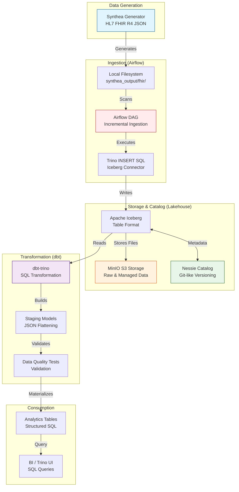

# Healthcare Data Mesh - Architecture & Dataflow

This document provides a comprehensive overview of the healthcare data mesh architecture, detailing how synthetic FHIR data is generated, ingested, versioned, and transformed into analytics-ready models.

## High-Level Architecture

The project follows a modern **Lakehouse Architecture** using Apache Iceberg, Nessie, and Trino.

## Detailed Component Breakdown

### 1. Data Generation Layer
- **Technology:** [Synthea™](https://github.com/synthetichealth/synthea)
- **Output:** Patient-centric FHIR R4 JSON bundles.
- **Workflow:** Generates realistic, yet 100% synthetic, medical records including demographics, conditions, encounters, and observations.

### 2. Ingestion & Orchestration Layer
- **Orchestrator:** Apache Airflow
- **Mechanism:** The `healthcare_ingestion_incremental` DAG scans the local filesystem for new JSON bundles.
- **Processing:**
    1. Validates JSON structure.
    2. Uses Trino to insert data into the `iceberg.landing.fhir_bundles` table.
    3. Moves processed files to a `processed/` directory to prevent duplicate ingestion.

### 3. Lakehouse Layer (Storage & Catalog)
- **Storage:** MinIO (S3-compatible) stores the actual Parquet data files.
- **Table Format:** [Apache Iceberg](https://iceberg.apache.org/) provides ACID transactions, schema evolution, and partition evolution.
- **Catalog:** [Project Nessie](https://projectnessie.org/) acts as the metadata catalog, enabling Git-like branching, merging, and "WAP" (Write-Audit-Publish) workflows for data.

### 4. Transformation Layer (dbt)
- **Tool:** dbt (Data Build Tool) with the `dbt-trino` adapter.
- **Logic:** 
    - **Extraction:** Parses the raw `data` column (JSON string) from the landing table.
    - **Flattening:** Converts complex FHIR nested objects into relational columns.
    - **Models:**
        - `stg_patients`: Demographic information.
        - `stg_encounters`: Visit history.
        - `stg_conditions`: Diagnoses and health states.
        - `stg_observations`: Clinical measurements (vitals, labs).
- **Quality Control:** Every model includes schema tests (uniqueness, non-null, accepted values) to ensure data integrity.

### 5. Consumption Layer
- **Engine:** Trino (formerly PrestoSQL) provides high-performance, distributed SQL queries.
- **Access:** Users can query the flattened staging tables directly via the Trino CLI or Web UI, or connect BI tools (Tableau, Superset, etc.) for visualization.

## Technical Specifications

| Service | Port | Description |
|---------|------|-------------|
| **Trino** | 8080 | SQL Query Engine & Web UI |
| **MinIO** | 9001 | S3 Storage Console |
| **Airflow** | 8081 | DAG Orchestrator UI |
| **Nessie** | 19120 | Data Catalog REST API |

---
*Created by Gemini CLI - Data Mesh Architect Prototype*
