# Healthcare Data Mesh - Architecture & Dataflow

This document provides a comprehensive overview of the healthcare data mesh architecture, detailing how synthetic FHIR data is generated, ingested, versioned, and transformed into analytics-ready models.

## High-Level Architecture

The project follows a modern **Lakehouse Architecture** using Apache Iceberg, Nessie, and Trino.

```mermaid
graph LR
    subgraph "Data Generation"
        A[Synthea Generator<br/>HL7 FHIR R4 JSON]
    end

    subgraph "Storage & Catalog (Lakehouse)"
        E[MinIO S3 Storage<br/>Raw & Managed Data]
        F[Nessie Catalog<br/>Git-like Versioning]
        G[Apache Iceberg<br/>Table Format]
    end

    subgraph "Ingestion (Airflow)"
        C[Airflow DAG<br/>Incremental S3 Pull]
        MS[Trino Memory Staging<br/>High-Speed Scratchpad]
    end

    subgraph "Transformation (dbt)"
        H[dbt-trino<br/>SQL Transformation]
        I[Staging Models<br/>JSON Flattening]
        J[Data Quality Tests<br/>Validation]
    end

    subgraph "Consumption (BI & Analytics)"
        K[Analytics Tables<br/>Structured SQL]
        L[Streamlit Dashboard<br/>Python Visualization]
    end

    %% Data Flow
    A -->|AWS CLI Sync| E
    E -->|List/Read| C
    C -->|Load/Stage| MS
    MS -->|Bulk Insert| G
    G -->|Stores Parquet| E
    G <-->|Metadata| F
    G -->|Reads| H
    H -->|Builds| I
    I -->|Validates| J
    J -->|Materializes| K
    K -->|Query| L

    %% Styling
    style A fill:#e1f5fe,stroke:#01579b
    style E fill:#fff3e0,stroke:#e65100
    style F fill:#e8f5e9,stroke:#1b5e20
    style H fill:#f3e5f5,stroke:#4a148c
    style C fill:#ffebee,stroke:#b71c1c
    style L fill:#fff9c4,stroke:#fbc02d
    style MS fill:#eeeeee,stroke:#333333
```

## Detailed Component Breakdown

### 1. Data Generation Layer
- **Technology:** [Synthea™](https://github.com/synthetichealth/synthea)
- **Workflow:** Generates FHIR R4 JSON bundles and uses the **AWS CLI** to automatically sync them to the `landing-zone/raw/fhir/` prefix in MinIO.
- **Benefit:** Decouples data generation from the orchestration layer, allowing for independent scaling and "push-based" delivery to the lake.

### 2. Ingestion & Orchestration Layer
- **Orchestrator:** Apache Airflow
- **Mechanism:** The `healthcare_ingestion_incremental` DAG pulls directly from S3 (MinIO).
- **Memory Staging Pattern:** 
    1. **S3 Scan:** Airflow identifies new JSON files in MinIO that haven't been ingested yet.
    2. **Memory Stage:** Small batches of files are read and inserted into a **Trino Memory Connector** table. This acts as a high-speed scratchpad, preventing the Trino Coordinator from being overwhelmed by large SQL strings.
    3. **Bulk Commit:** A single `INSERT INTO ... SELECT` query moves data from Memory to the persistent Iceberg table.
- **Safety Rails:** Skips files over **3MB** to ensure Trino cluster stability.

### 3. Lakehouse Layer (Storage & Catalog)
- **Storage:** MinIO (S3-compatible) stores both the raw JSON landing files and the managed Parquet data files.
- **Table Format:** [Apache Iceberg](https://iceberg.apache.org/) provides ACID transactions, schema evolution, and partition evolution.
- **Catalog:** [Project Nessie](https://projectnessie.org/) acts as the metadata catalog, enabling Git-like branching, merging, and "WAP" (Write-Audit-Publish) workflows for data.

### 4. Transformation Layer (dbt)
- **Tool:** dbt (Data Build Tool) with the `dbt-trino` adapter.
- **Logic:** 
    - **Flattening:** Converts complex FHIR nested objects into relational columns.
    - **Marts:** Builds `dim_patients`, `fct_encounters`, `fct_conditions`, `fct_medications`, and `fct_vitals`.
- **Quality Control:** Every model includes schema tests (uniqueness, non-null, accepted values) to ensure data integrity.

### 5. Consumption Layer (BI & Visualization)
- **BI Tool:** **Streamlit** provides real-time dashboards for clinical and operational metrics.
- **Engine:** Trino handles high-performance, distributed SQL queries across the Iceberg tables.

---
*Created by Gemini CLI - Data Mesh Architect Prototype*
